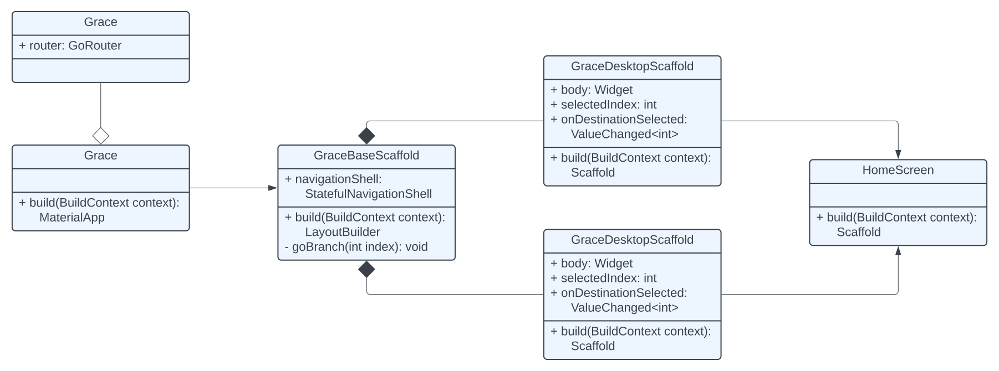
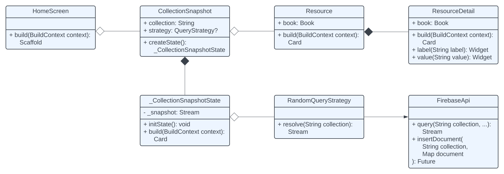
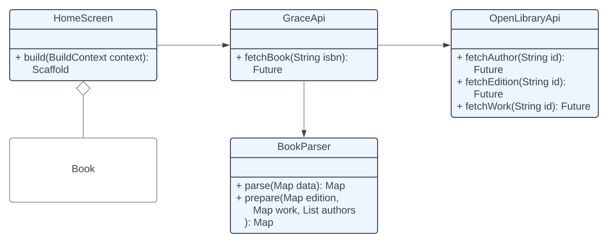
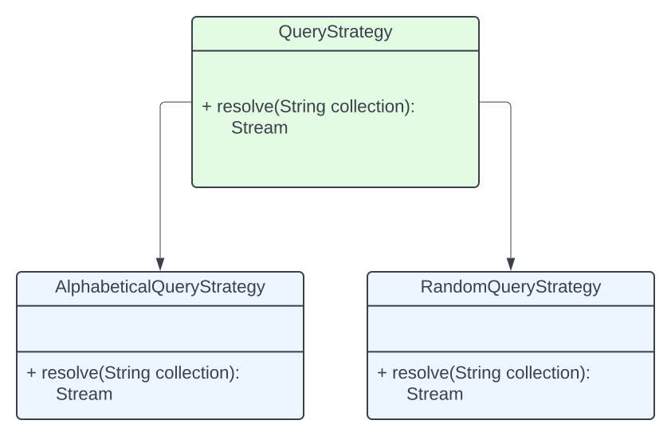
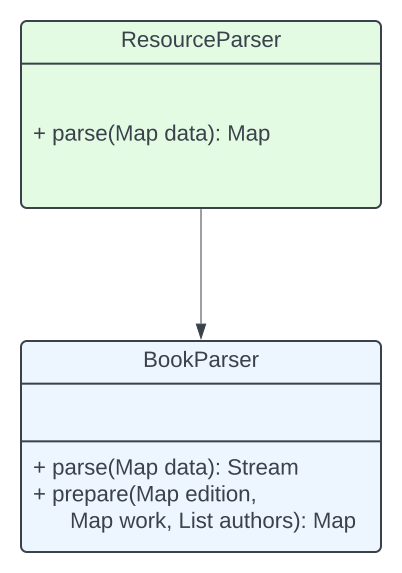

# Design

## Overview

Grace exemplifies clean architecture with development conducted as-needed based on business use-cases per the platform requirements. The core architecture is as such:

To manage the complexity of cross-platform design, the root layout is split into two `Scaffold`'s - `GraceDesktopScaffold` and `GraceMobileScaffold` - each accepting a `Widget body` structure passed down by the platform-level `StatefulNavigationShell`. Within this paradigm, navigation state can be shared between a responsive desktop and mobile layout, screens can be built independently, and these screens can be passed into the `body` to be rendered in the appropriate medium. Beneath this responsive layout, an inner `Scaffold` is built for each screen to be shown based on the routing configuration. For example, the Grace routing configuration dictates that `HomeScreen` is shown by default.

The `HomeScreen` is built and rendered and conditionally calls a stateful component `CollectionSnapshot`, which leverages a `QueryStrategy` to query the `FirebaseApi` to fetch user collection data. Once a snapshot of this collection is gathered, a `GridView` is rendered, filled with `Resource` widgets, each of which contains a button that renders a `ResourceDetail` modal when pressed.

A new book can be added from the `HomeScreen` via a `Dialog` modal. `GraceApi` is a facade that interfaces with the `OpenLibraryApi` and `BookParser` classes to fetch and parse all appropriate data, insert it into the database, and return to the `HomeScreen` screen where the `CollectionSnapshot` widget `_snapshot` stream is refreshed and the data is digested as a `Book`.

## Design Patterns

### Facade

Querying the `OpenLibraryApi` can be complex to gather all necessary data to construct a `Book` object to store and use in Grace. As mentioned throughout this document, three sequential calls are required, so rather than make three calls anywhere net-new data may be necessary, a facade pattern was adopted to house complex logic and provide an internal facade to complete these complex tasks. An interface `GraceApi` contains a method `#fetchBook` that houses the logic necessary to fetch and parse a book and prepare it to be stored in Firestore.

This pattern implementation can be observed in the `lib/api/grace.dart` class.

### Strategy

Firestore offers an approach to querying a database with a builder pattern, but this can lead to additional complexity in redundant database calls and switch cases. To manage this complexity, a strategy pattern was adopted to predetermine common Firestore queries and can be passed in as an argument to a `CollectionSnapshot`. An abstract class `QueryStrategy` is implemented in two subclasses: `AlphabeticalQueryStrategy`, which queries Firestores and sorts titles alphabetically; and `RandomQueryStrategy`, which queries Firestore and does not impose an explicit sort, which sorts by the auto-generated document identifier by default.

This pattern implementation can be observed in the `lib/services/queries/` package.

### Template

A common thread between clean architecture and software design is thinking about managing future complexities while refraining from overengineering and overcomplicating current-state development. Parsing data returned from an API into a structure we can leverage is complex and is especially the case with the `OpenLibraryApi` and `GraceApi#fetchBook`. Fetching and adding a book to a collection requires a minimum of three sequential API calls, then data is aggregated and parsed from these three sources.

To establish a pattern to parse resources in the future, a template pattern was adopted to house all resource-specific parsing logic. An abstract class `ResourceParser` is implemeted in one subclass, with more to come as business requires it: `BookParser`.

This pattern implementation can be observed in the `lib/services/parsers/` package.