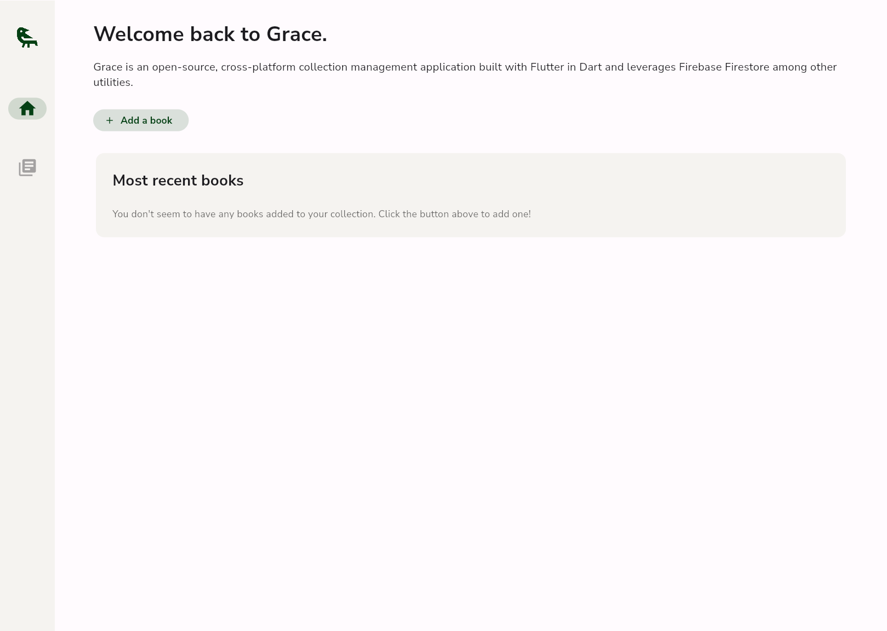
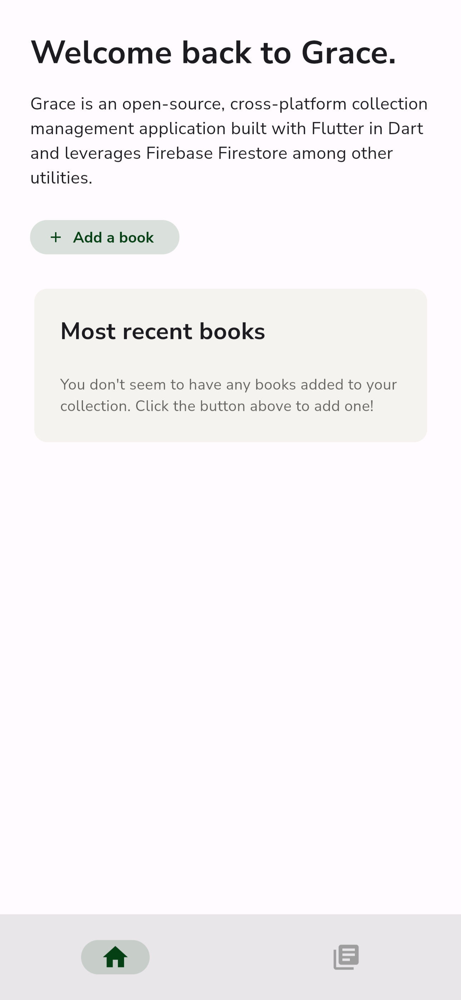
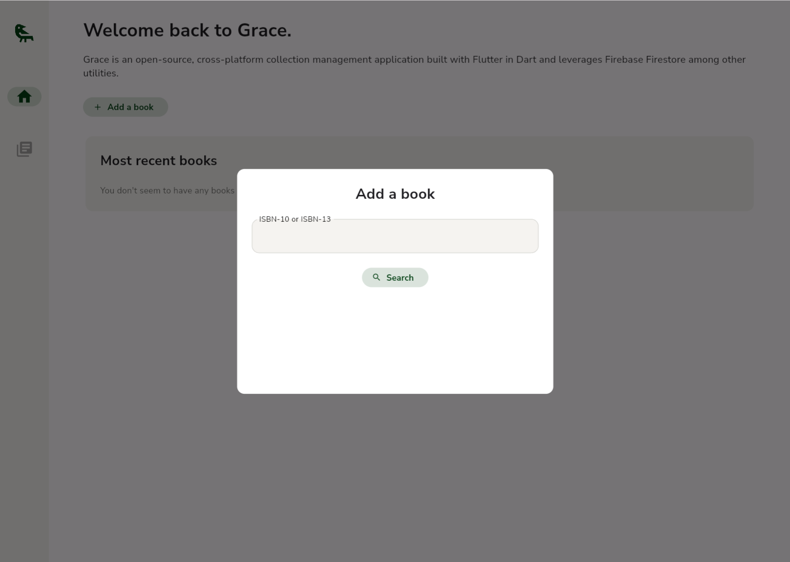
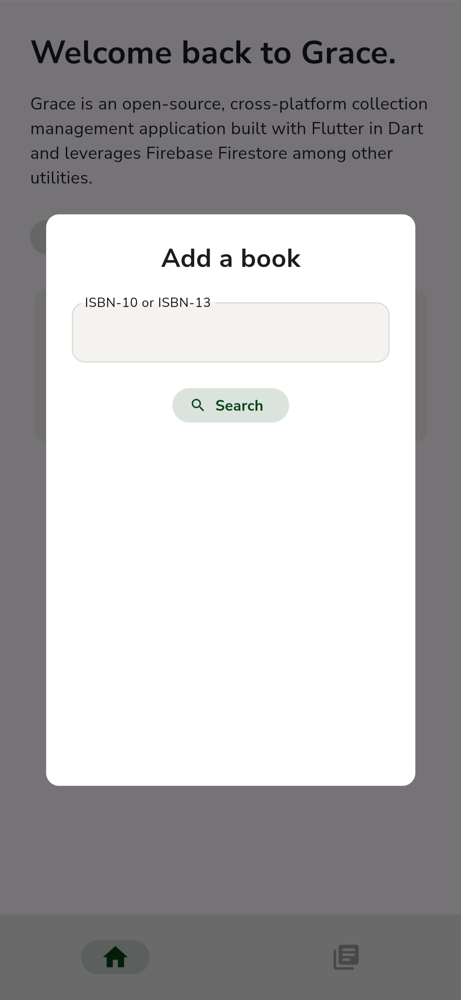
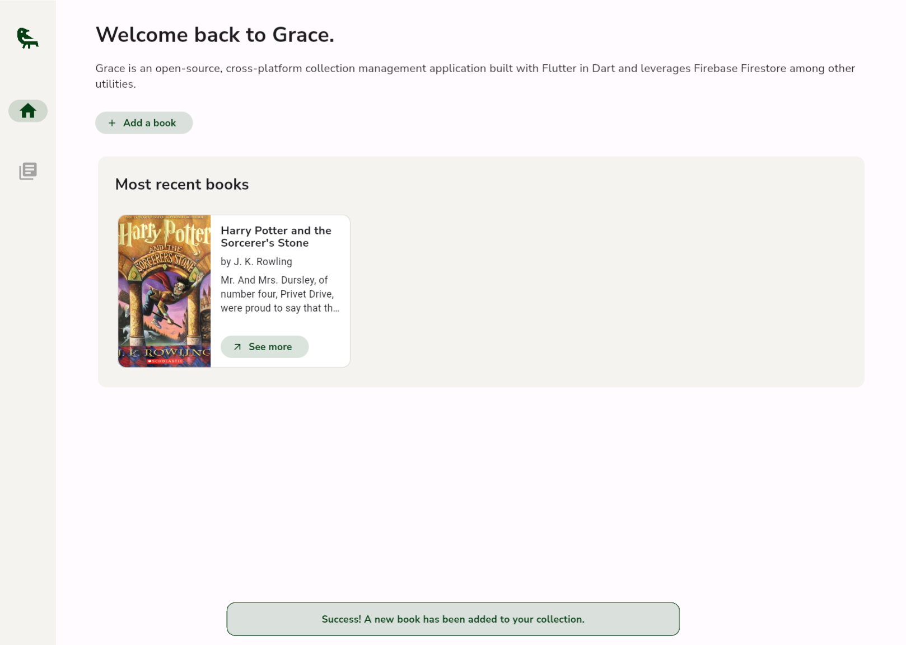
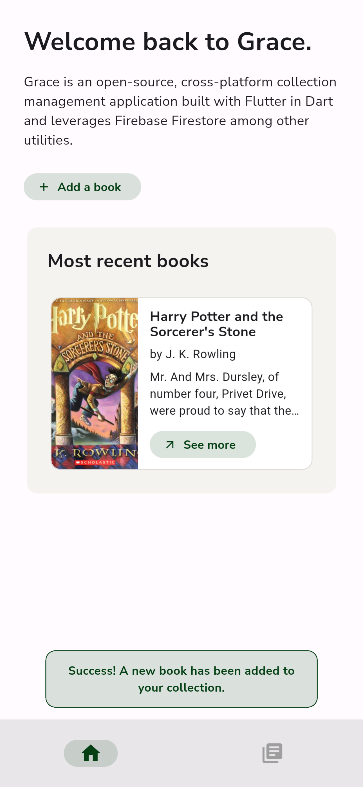
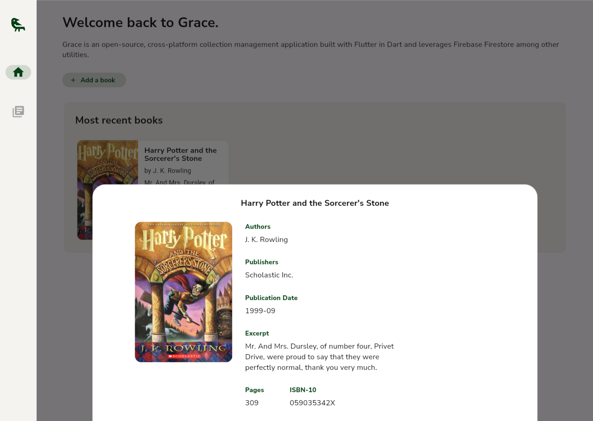
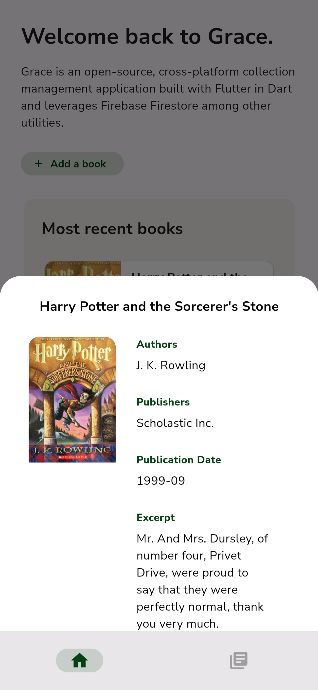

# Grace User Manual

Hello, and welcome to Grace, a cross-platform application providing graceful collection management! Using this application is simple and onboarding can be completed in a few easy steps.

## Getting Started

Grace can be downloaded either via the Canvas submission or [GitHub repository](https://github.com/muzzarellimj/grace), which can be cloned with `git clone https://github.com/muzzarellimj/grace.git`. Once it has been downloaded, open a terminal in the project folder and run the following commands:

```
flutter pub get
flutter run
```

The latter command will prompt you to select a platform based on the available native and emulated devices, so feel free to pick whichever is available - I prefer Chrome or iOS. After the application has launched, you should see the following screen on desktop or mobile, respectively:

<div style="display: flex; justify-content: space-around; padding: 2rem 0">


</div>

## Adding a Book

Once you have made it to the home screen, you should see a message prompting you to add a book to your collection. To do so, press the "Add a book" button toward the top-left corner of the application, and you should now see this screen on desktop or mobile, respectively:

<div style="display: flex; justify-content: space-around; padding: 2rem 0">


</div>

And adding the book is simple - enter the ISBN-10 or ISBN-13 number of the book you want to add, then click the "Search" button in the center of the modal. Once the book has been added successfully, you should be brought back to the home screen, which should look like this screen or desktop or mobile, respectively:

<div style="display: flex; justify-content: space-around; padding: 2rem 0">


</div>

The green notification message in the bottom center of your screen indicates that your book was added successfully, and your book should now be visible in a resource card on the screen. Voila! Your favorite book is now in your collection forever.

## Viewing a Book

Now that you have books added to your collection, it will be important to view more information about them to remember the books you do own, you don't own, the cover art on each copy, and more. The resource card on the home screen provides a quick glance at a book - the cover, title, author(s), and excerpt should all appear within the card, but this can feel a little too condensed. Each resource card has a "See more" button, and when pressed, you should see the following screen on desktop or mobile, respectively:

<div style="display: flex; justify-content: space-around; padding: 2rem 0">


</div>

A non-intrusive window should appear to provide additional information about your book such as the publishers, contributors, ISBN numbers, and more. This window is scrollable and can easily be exited by clicking or tapping in the darkened area around the window.

## Celebrate Your Collection

Now that you have your first book added - add them all! Enjoy viewing your collection in a sleek, accessible platform that gives you the grace to collect more.